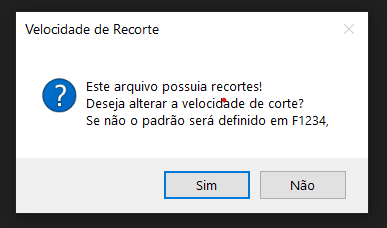
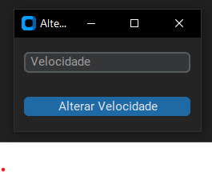
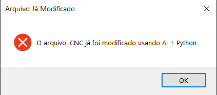

<h2 align="center">Script simples que faz algumas alterações em arquivos .cnc gerados pelo software da maquina de corte plasma cnc.</h2>

<h3>Funcionamento: </h3>
- Procura se arquivo é valido .cnc;
- Procura se a primeira linha contém "G70". "G21", "g21", ou cometario pré definido;
- Apaga as 5 primeiras linhas;
- Substitui todas as linhas com "T0" por "G21";
- Substitui todas as correspondecias de "G21" por "M5G0Z5";
- Substitui apenas a ultima linha "G21" por "M21";
- Verificar todas as linhas que começam com "G01", "G02" ou "G03" e abre janela pro usuario digitar a velocidade;

